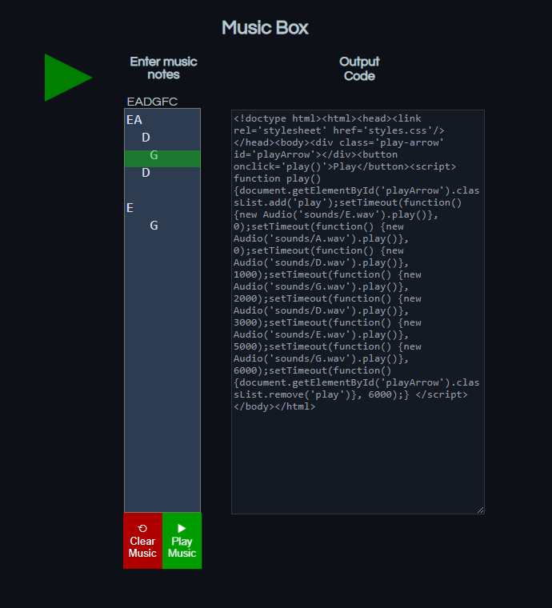

# Music-Box-Compiler
Enter musical notes on the left underneath the corresponding musical note and play a song that compiles into its own HTML file. This program demonstrates a custom language compiler that performs Lexical, Syntax and Semantic analysis of a musical note based language.

</img>

